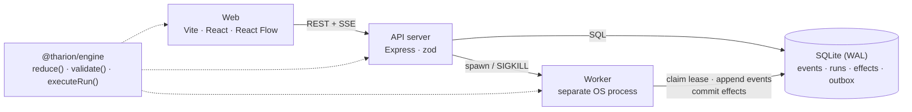
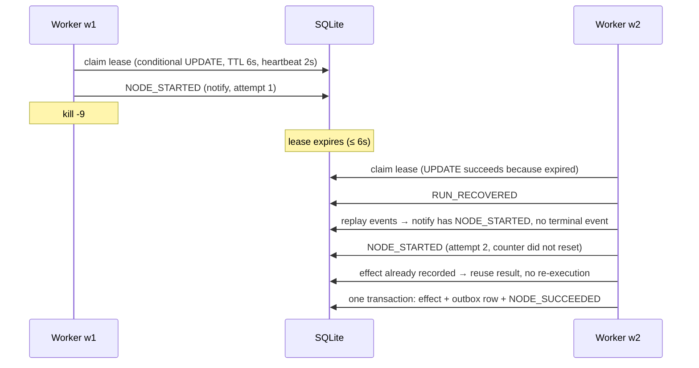

# THARION: the workflow engine that remembers

LIVE DEMO - [tharion.onrender.com] 

> *What if you could Ctrl+Z an automation after it already ran?*

Tharion is a visual workflow automation engine where **every execution is a recorded, inspectable, forkable timeline**.
Scrub through a finished run like video, see the exact data on every edge at every moment, edit an input at any step, and fork a new run from that point.
The engine is **durable**: `kill -9` the worker mid-run and another worker resumes it, with no duplicated side effects.

Built solo for Algothon'26 (ALG-AUTO-01, Visual Workflow Automation).

**Delivery semantics, stated honestly:** at-least-once step execution with idempotent effects. Tharion does not claim exactly-once.

---

## Quickstart (local, full demo)

Requires Node 20+ (22 recommended) and pnpm 9+. Works in WSL.

```bash
pnpm install
pnpm seed:demo     # resets the local DB and seeds 3 templates + a real run history (~15s). Stop `pnpm dev` first.
pnpm dev:all       # API + supervised worker on :3001, web on :5173
```

Open <http://localhost:5173>. 

Optional: `export ANTHROPIC_API_KEY=...` before `pnpm dev:all` for live AI; without a key the AI features use cached samples (clearly labeled in the UI).

```bash
pnpm test            # full suite (includes chaos tests that spawn real worker processes)
pnpm test:evidence   # same, and writes evidence/test-results.json (shown on the in-app Tests page, key 4)
pnpm typecheck       # strict TS across all packages + a ban on `any` in the engine
pnpm start:readonly  # build the web app and serve it read-only (what the deployed build runs)
```

### Environment

| Variable | Default | Purpose |
|---|---|---|
| `PORT` | `3001` | API port |
| `THARION_DB` | `./data/tharion.db` | SQLite file |
| `READ_ONLY` | off | `1` = reject mutations (except Investigate), no worker, serve the built web app |
| `AUTO_RESTART` | off | `1` = supervisor restarts a killed worker (off so the audience sees the gap) |
| `NO_WORKER` | off | `1` = don't spawn a worker (run `pnpm worker` yourself) |
| `POLL_MS` | `500` | worker poll interval |
| `ANTHROPIC_API_KEY` | none | live Investigate / Describe |
| `THARION_MODEL` | `claude-sonnet-5-5` | model for the two AI features |

---

## What it does

| Area | Features |
|---|---|
| **Build** | React Flow editor with custom node cards, typed port colors, snap grid, minimap, palette (drag or click), inspector with live JSONata preview against sample data, live validation (invalid edge turns red with the reason), versioned save, templates, duplicate, JSON export/import, **Describe Workflow** (AI) |
| **Run** | Live canvas driven by SSE (nodes pulse/succeed/fail/skip, packets travel edges, hover an edge for its payload), event log with node/level filters, search, copy-as-JSON and follow-tail, fault injection, dry run, trigger payload editor, duplicate-webhook test, **chaos panel** (hold-to-kill, lease countdown, recovery banner, outbox proof) |
| **Rewind** | Multi-lane scrubber, drag/click/step/autoplay, graph state at any event, time inspector with attempt history and side-by-side diffs, **fork from here** with edited input, lineage tree, **run diff** with the divergence node pulsing, **Investigate Failure** |
| **Tests** | In-app page showing real vitest results |

Node catalog: `trigger` (manual/webhook), `http` (real or `mock://ok|slow|flaky|fail-once`), `transform` (JSONata), `condition` (true/false handles), `delay`, `notify` (writes the outbox), `output`.

### Keyboard

`1` Build · `2` Run · `3` Rewind · `4` Tests · `⌘K` palette · `⌘S` save · `Space` run / play-pause · `←/→` step events · `F` focus fork input · hold `K` to kill the worker

---

## Architecture



The same `reduce()` function turns events into run state in the **server, worker and browser**, so the Rewind scrubber and the live engine can never disagree.

```
packages/
  engine/   types, validator, reducer, executor, node impls, fork planning, diff, templates   (pure, no I/O, no `any`)
  db/       SQLite schema + migrations, SqliteStore (fenced appends), repo, forkRun, seedDemo
  server/   Express API, SSE, supervisor (spawns/kills the worker), AI features, evidence
  worker/   the separate process: claim lease → replay events → execute → heartbeat
  web/      Vite + React + React Flow + Zustand + Tailwind tokens from the mockup
  tests/    Vitest: engine, durability (real processes), fork/diff, AI (mocked LLM), REST
```

### Crash recovery



### Key decisions

- **Event sourcing.** The append-only `events` table is the only source of truth, enforced by SQLite triggers that reject UPDATE and DELETE. Run state is always derived by `reduce(def, events, upTo)`.
- **Leases with fencing.** Workers claim runs with an atomic conditional UPDATE. Every event append is also fenced (`INSERT … WHERE the run's lease_owner = me`), so a paused or zombie worker that lost its lease cannot write. It gets `LeaseLostError` and abandons the run.
- **Idempotency key = `runId:nodeId`**, stable across attempts (not per-attempt). A per-attempt key would let a retry after a crash deliver twice. The `effects` and `outbox` tables are `UNIQUE (run_id, node_id)`, and the effect row, outbox row and `NODE_SUCCEEDED` commit in **one transaction**. If the crash lands between the external effect and the commit, the retry finds the effect row and returns the recorded result without re-executing (test 8 SIGKILLs a real worker at exactly that point).
- **Resume rule.** A node with `NODE_STARTED` and no terminal event is re-executed on resume. Its attempt counter does not reset, and persisted retry delays are honored.
- **Fork = new run.** `parentRunId` + `forkedAtNodeId`. Upstream nodes become `NODE_REPLAYED` (memoized output, no re-execution, no effects). Upstream nodes that were skipped stay skipped. The forked node runs with the overridden input and everything downstream executes. Forking is rejected if an upstream node never completed.
- **Typed validation blocks execution:** cycles, unreachable nodes, edge type mismatches (with a human reason), invalid JSONata, conditions that don't return a boolean on sample data, missing trigger. Warnings (no output, orphan outputs) don't block.
- **No fake data.** Mock HTTP modes are real, deterministic node behavior. The UI is driven by the API and SSE, never by canned animations.
- **AI is tier 2.** The engine works without it. Both AI features degrade gracefully (see below).

### Event types

`RUN_STARTED` · `NODE_SCHEDULED` · `NODE_STARTED` · `NODE_SUCCEEDED` · `NODE_FAILED_ATTEMPT` · `RETRY_SCHEDULED` · `NODE_FAILED` · `NODE_SKIPPED` · `NODE_REPLAYED` · `RUN_RECOVERED` · `RUN_COMPLETED` · `RUN_FAILED` · `RUN_CANCELLED`

### API (selected)

| Route | Purpose |
|---|---|
| `GET/POST /api/workflows`, `GET/PUT /api/workflows/:id` | list / create, load (`?version=`) / save a new version |
| `POST /api/workflows/:id/validate` · `/runs` · `/hook` | validate a draft, start a run, create a webhook token |
| `POST /api/hooks/:token` | webhook trigger, deduped by the `Idempotency-Key` header |
| `GET /api/runs`, `/runs/:id`, `/runs/:id/events`, `/runs/:id/stream` | list, detail with derived state, event log, SSE |
| `POST /api/runs/:id/fork` · `GET /api/diff?a=&b=` · `GET /api/runs/:id/lineage` | time travel |
| `POST /api/runs/:id/investigate` · `POST /api/ai/describe` | AI features |
| `GET /api/outbox` · `GET /api/system` | observable side effects, worker and lease status |
| `POST /api/chaos/kill-worker` · `/start-worker` · `/auto-restart` | chaos |

---

## Testing

`pnpm test` runs Vitest across the whole system. The chaos tests spawn a real worker OS process through the real supervisor and REST endpoints, SIGKILL it, restart it, and assert on the SQLite state.

| PRD test | File |
|---|---|
| 1 validation | `validator.test.ts` |
| 2–5 linear data passing, condition + skip propagation, fan-out/fan-in, retry/backoff | `executor.test.ts` |
| 6 reducer determinism, prefix replay equals live state | `reducer.test.ts` |
| 7–8 crash recovery, no duplicate effects (real SIGKILL, including between effect and commit) | `chaos.test.ts` |
| 9 lease contention + fencing | `lease.test.ts` |
| 10 fork | `fork.test.ts`, `rewind-api.test.ts` |
| 11 diff | `diff.test.ts`, `rewind-api.test.ts` |
| 12 webhook idempotency | `server.test.ts` |
| 13 append-only events | `db.test.ts` |
| 14 AI describe/investigate with a mocked LLM | `ai.test.ts` |
| extras | engine-level recovery, templates, log helpers, seed, evidence, read-only guard |

Latest results: `evidence/test-results.json` (also on the in-app Tests page).

---

## Demo script (2:30)

Pre-flight: `pnpm seed:demo` (server stopped) → `pnpm dev:all` → open `:5173`. Check the worker pill is green. Have the backup video ready.

1. **0:00 Build.** "What if you could Ctrl+Z an automation after it already ran?" Open *Order Intake*. In the Inspector, set **Normalize → declared output type → string**. The Normalize→Enrich edge turns red, hover shows the reason, and Run is disabled. Set it back to `object`.
2. **0:25 Run.** Press Run. Packets flow, branches run in parallel, *Fetch Customer* fails once and retries (attempt 2), the log streams. Hover an edge to show its payload.
3. **0:50 Chaos.** Faults → *Slow node* → Enrich → Arm → Run. While Enrich runs, **hold KILL WORKER**. Worker dead, lease counting down. Click START WORKER. Banner: *run resumed on w2*. The proof card shows **exactly 1 outbox row** per notify node. Say the honest line: at-least-once execution, idempotent effects.
4. **1:20 Rewind.** Open the seeded failed run (Order Intake, age `"twenty"`) in Rewind. Scrub back, edges show payloads at that moment. Click *Normalize*: `"age": "twenty"` → `isAdult: null`.
5. **1:45 Fork.** Edit the age to `20`, press **Fork**. The branch split plays and the new run completes.
6. **2:00 Diff.** Diff view: divergence pulses at *Normalize*, `isAdult: null → true`.
7. **2:15 Investigate.** On the failed run: Investigate → root cause + evidence chips (click to jump the playhead) → **Fork with suggested fix**.
8. **2:25 Tests.** Open the Tests page (key `4`): N/N PASS. Tagline.

**If a judge asks "is this exactly-once?"** No. Steps run at-least-once. A crash can re-execute a node. Side effects are made idempotent by a stable `runId:nodeId` key with a unique effect row committed atomically with the success event. The outbox proves one delivery.

---

## Deployment

- **Local (primary, full demo):** everything above, including real worker kills.
- **Deployed (read-only):** a Docker image that seeds the DB at build time and serves the built web app with `READ_ONLY=1`. There is no worker, so mutations (run, save, fork, chaos) return 403, and the UI shows "read-only demo · seeded runs". Rewind, diff, lineage, the Tests page (committed evidence) and Investigate (cached sample, or live with a key) all work on the seeded history.

```bash
docker build -t tharion .
docker run -p 8080:8080 [-e ANTHROPIC_API_KEY=...] tharion
```

Works on any Docker host (Render, Fly, Railway). Commit `pnpm-lock.yaml` and `evidence/test-results.json` first.

---

## Known limitations

- **SQLite, single node.** One writer. Multiple workers are supported through leases, but the UI supervises one.
- **Only `notify` effects are idempotent by construction.** Non-mock HTTP calls are at-least-once to the external system and do not forward an idempotency key. The email channel is a mock that writes the outbox.
- **Forks change inputs, not graphs.** Editing the workflow graph in a fork is not supported.
- **Time travel rewinds Tharion's record, not the outside world.** Effects already delivered stay delivered.
- **Investigate** verifies that cited event seqs exist. It does not string-match the quoted text. The prompt covers the last 300 events and up to 3 recent successful runs.
- **Run diff** requires both runs to use the same workflow version.
- **SSE is polling-based** (200ms) because the worker is a separate process.
- **No auth or multi-user editing, no cron/loops/code node/database node.**
- **`RUN_CANCELLED`** exists in the event model, but there is no cancel endpoint or UI.
- **Webhook payloads** must be JSON objects. Reduced-motion is respected; a formal contrast audit was not done.
